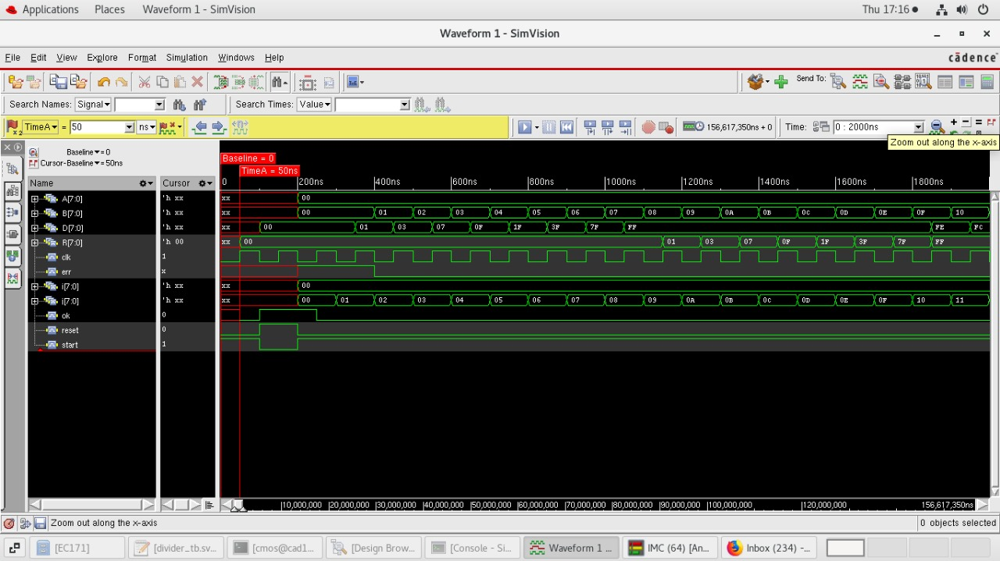
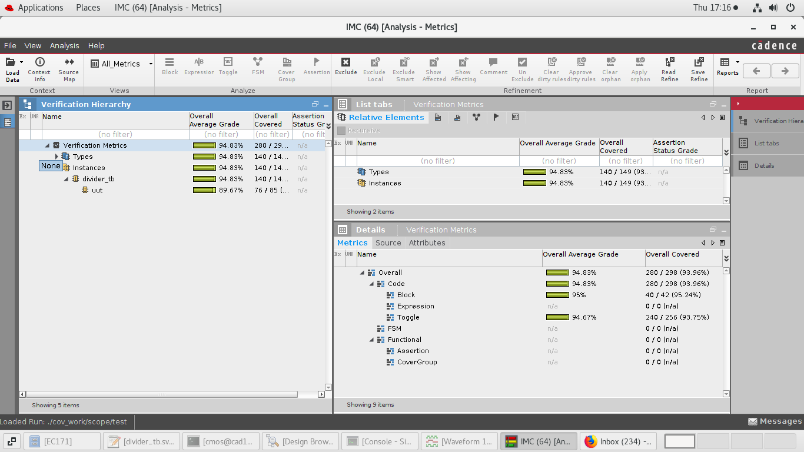

# 8-Bit Unsigned Divider in Verilog - README

This README provides an overview of the 8-bit unsigned divider design code (`divider`) and its SystemVerilog testbench (`divider_tb`). These modules are designed to perform division operations on 8-bit unsigned integers.

## Divider Module (divider.v)

### Description

The `divider` module is designed for 8-bit unsigned integer division. It takes two 8-bit inputs, `A` (dividend) and `B` (divisor), and produces the following outputs:

- `D` (quotient): The result of the division.
- `R` (remainder): The remainder left after the division.
- `ok`: A signal indicating that the division operation is complete.
- `err`: An error signal indicating division by zero (`B` is zero).

### Operation

The `divider` module operates based on a state machine, breaking down the division process into smaller steps to calculate the quotient and remainder. It handles setup, iteration, and completion of the division operation. The operation is only initiated when `start` is asserted.

## Testbench Module (divider_tb.sv)

### Description

The `divider_tb` is a SystemVerilog testbench module used to simulate and verify the functionality of the `divider` module. It includes test cases for different inputs, generates the clock signal (`clk`), and monitors the outputs to ensure the correctness of the divider's operation.

### Usage

To simulate and test the `divider` module, follow these steps:

1. Clone or download the Verilog source files, including `divider.v` and `divider_tb.sv`.

2. Use a SystemVerilog simulator, such as ModelSim or XSIM, to run the simulation.

3. In the `divider_tb` module, provide input stimulus for `A` and `B`, generate the clock signal, and control the reset and start signals.

4. Run the simulation, and monitor the `D`, `R`, `ok`, and `err` signals to verify the correctness of the division operation.

### Example Testbench Usage

Here's an example of how to use the `divider_tb` module:

```systemverilog
module divider_tb;

  // Signal declarations and instantiating the divider module (uut)

  initial begin
    // Initialize signals and generate clock

    // Provide test cases for inputs A and B

    // Run the simulation and monitor the outputs

    // Verify the results and check for correctness

    // End simulation
  end

endmodule
```

## Adding Waveform and Coverage Plots

1. **Waveform Plots**:

   You can find an example waveform plot below that shows the behavior of the `divider` module during simulation:

   

2. **Coverage Reports**:

   To assess the quality of our tests, we use SystemVerilog's code coverage. Below is a coverage report that helps us analyze the code coverage achieved during simulation:

   


## License

The provided design code and testbench are open-source and can be used and modified under appropriate licensing terms. Please refer to the license file (if available) for details.

## Resources Used

Cadence Tool suite:
1)NC-verilog
2)IMC/Xcelium

